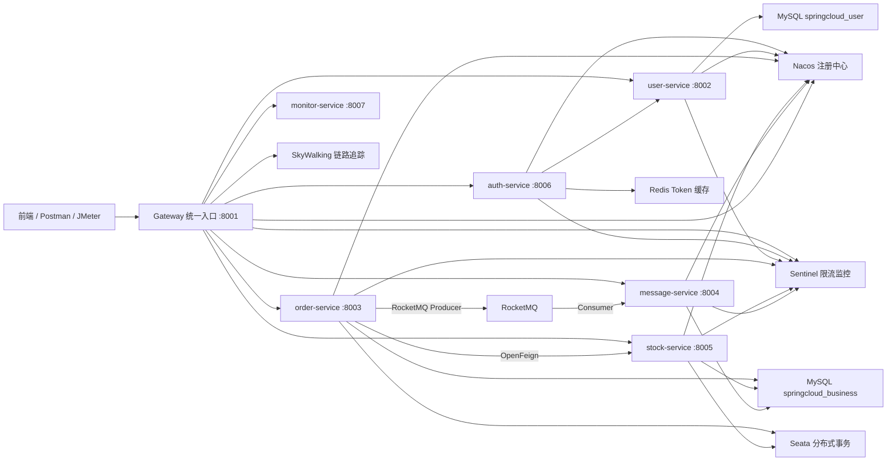
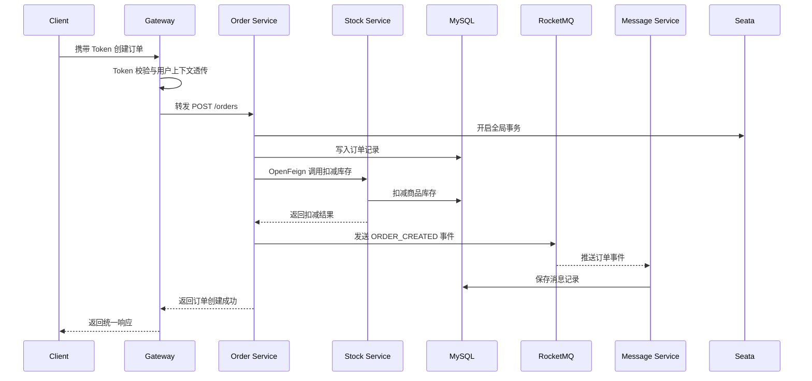

# 基于 Spring Cloud Alibaba 的微服务电商订单管理系统

## 一、项目概述

本项目是一个基于 Spring Boot、Spring Cloud 和 Spring Cloud Alibaba 的微服务电商订单管理系统，围绕“用户认证、库存查询、订单创建、库存扣减、订单消息通知”这一核心业务链路进行设计。系统拆分为认证服务、用户服务、订单服务、库存服务、消息服务、网关服务、监控服务和公共组件模块，具备服务注册发现、统一网关入口、Token 鉴权、OpenFeign 远程调用、Seata 分布式事务、RocketMQ 异步消息、Sentinel 限流保护、Redis 缓存和 MySQL 持久化等能力。

## 二、技术栈说明

| 分类 | 技术 |
| --- | --- |
| 基础框架 | Spring Boot 3.2.4、Spring Cloud 2023.0.1 |
| 微服务组件 | Spring Cloud Alibaba 2023.0.1.0 |
| 注册与配置中心 | Nacos |
| 网关 | Spring Cloud Gateway |
| 服务调用 | OpenFeign、Spring Cloud LoadBalancer |
| 限流熔断 | Sentinel |
| 分布式事务 | Seata |
| 消息队列 | RocketMQ |
| 缓存 | Redis |
| 数据库 | MySQL |
| ORM | MyBatis Plus |
| 构建工具 | Maven |
| Java 版本 | JDK 17 |
| 链路追踪 | SkyWalking Agent、Micrometer Tracing |

## 三、模块划分

| 模块 | 职责 |
| --- | --- |
| `gateway` | 系统统一入口，负责路由转发、跨域配置和 Token 透传 |
| `auth-service` | 负责用户注册、登录、Token 签发和登录用户信息查询 |
| `user-service` | 负责用户数据管理，提供内部用户创建和查询接口 |
| `order-service` | 负责订单创建、订单查询、调用库存服务、发送订单消息 |
| `stock-service` | 负责商品库存查询和库存扣减 |
| `message-service` | 负责消费订单消息并保存消息记录 |
| `monitor-service` | 负责监控入口和基础健康检查 |
| `common-core` | 通用返回结构、异常、Token 工具、基础配置 |
| `common-security` | 请求鉴权、用户上下文、全局异常处理 |
| `common-redis` | Redis 配置和缓存工具 |
| `common-log` | 操作日志注解和 AOP 处理 |

## 四、系统架构图

## 五、订单创建流程图

## 六、核心功能实现说明

### 1. 网关统一入口

Gateway 通过 `application.yml` 配置路由，将 `/api/auth/**`、`/api/users/**`、`/api/orders/**`、`/api/messages/**`、`/api/stock/**` 转发到对应微服务。网关作为系统统一入口，降低客户端直接访问多个服务的复杂度。

代码证据：

- `gateway/src/main/resources/application.yml`
- `gateway/src/main/java/com/gzu/gateway/filter/AuthHeaderRelayFilter.java`

### 2. 认证与 Token

`auth-service` 提供注册、登录和当前用户查询接口。登录成功后签发 Token，并将 Token 缓存到 Redis，用于后续快速鉴权。

代码证据：

- `auth-service/src/main/java/com/gzu/auth/controller/AuthController.java`
- `auth-service/src/main/java/com/gzu/auth/service/impl/AuthServiceImpl.java`
- `common/common-core/src/main/java/com/gzu/common/core/security/TokenUtil.java`

### 3. OpenFeign 服务调用

认证服务通过 Feign 调用用户服务，订单服务通过 Feign 调用库存服务，实现微服务之间的远程调用和职责拆分。

代码证据：

- `auth-service/src/main/java/com/gzu/auth/feign/UserFeignClient.java`
- `order-service/src/main/java/com/gzu/order/feign/StockFeignClient.java`

### 4. Seata 分布式事务

订单创建时使用 `@GlobalTransactional` 开启全局事务，订单写入和库存扣减处于同一业务事务链路中，避免订单成功但库存扣减失败造成数据不一致。

代码证据：

- `order-service/src/main/java/com/gzu/order/service/impl/OrderServiceImpl.java`
- `common/common-core/src/main/java/com/gzu/common/core/config/SeataConfig.java`

### 5. RocketMQ 异步消息

订单创建成功后，订单服务发送 `ORDER_CREATED` 消息到 RocketMQ，消息服务消费该消息并保存消息记录，实现订单主流程和消息记录的解耦。

代码证据：

- `order-service/src/main/java/com/gzu/order/mq/producer/OrderEventProducer.java`
- `message-service/src/main/java/com/gzu/message/mq/consumer/OrderEventConsumer.java`

### 6. Sentinel 限流保护

系统接入 Sentinel Dashboard，并在公共模块中配置限流规则，保护服务在高并发访问下保持稳定。

代码证据：

- `common/common-core/src/main/java/com/gzu/common/core/config/SentinelRuleConfig.java`
- 各服务 `application.yml` 中的 `spring.cloud.sentinel.transport.dashboard`

## 七、数据库设计

| 表名 | 所属数据库 | 作用 |
| --- | --- | --- |
| `t_user` | `springcloud_user` | 保存用户账号、密码和角色 |
| `t_product_stock` | `springcloud_business` | 保存商品编码和库存数量 |
| `t_order` | `springcloud_business` | 保存订单用户、商品、数量、金额和状态 |
| `t_message_event` | `springcloud_business` | 保存订单消息消费记录 |
| `undo_log` | `springcloud_business` | Seata AT 模式事务回滚日志 |

## 八、测试结果

### 接口测试

已通过 Postman 跑通：

`注册/登录 -> 获取 Token -> 查询用户 -> 查询库存 -> 创建订单 -> 查询订单 -> 查询消息记录`

异常测试包括：

- 未携带 Token 访问订单接口。
- 库存不足时创建订单失败。

### 压力测试

已使用 JMeter 对登录、查询库存、创建订单进行压测：

- 总请求数：150
- 平均响应时间：约 16 ms
- 最大响应时间：66 ms
- 错误率：0.00%
- 吞吐量：约 16.3/s

详细结果见：

- `docs/jmeter-test-result-summary.md`
- `jmeter/html-report/index.html`

## 九、部署运行说明

1. 启动 Docker 基础组件：Nacos、Seata、Sentinel、RocketMQ、Redis、SkyWalking。
2. 启动 MySQL，并创建数据库 `springcloud_user`、`springcloud_business`。
3. 执行各服务下的 `schema.sql` 初始化表结构和演示库存数据。
4. 依次启动业务服务：
   - `user-service`
   - `stock-service`
   - `message-service`
   - `auth-service`
   - `order-service`
   - `gateway`
   - `monitor-service`
5. 打开 Nacos 控制台，确认服务注册成功。
6. 使用 Postman 或前端页面通过 Gateway 访问接口。

## 十、项目总结

本项目完成了一个典型微服务电商订单系统的核心闭环，实现了用户认证、网关路由、服务注册发现、远程服务调用、订单创建、库存扣减、分布式事务、异步消息和接口测试压测。项目模块职责清晰，公共组件抽取合理，技术栈覆盖 Spring Cloud Alibaba 微服务开发中的关键能力。

后续可继续完善：

- 增加更完整的单元测试和集成测试。
- 增加 Docker Compose 一键启动文件。
- 增加 OpenAPI/Knife4j 接口文档。
- 增加日志采集、告警和链路追踪展示。
- 对配置中心、密钥和数据库连接信息做更严格的生产化管理。
